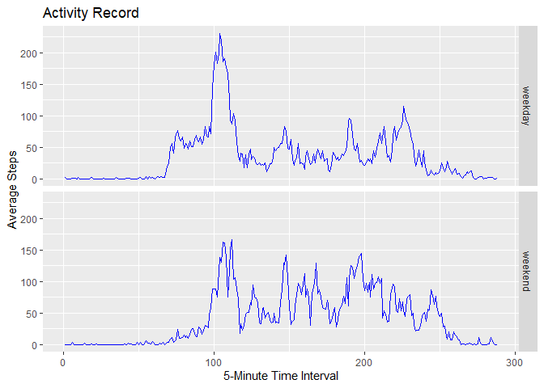

## Loading and preprocessing the data

The code below is used to load the data (if it isn't already loaded), unzip it and read the csv file.


```r
# Set Names/Locations
fileUrl <- "https://github.com/sharonevanscpt/RepData_PeerAssessment1/blob/master/activity.zip"
fileName <- "activity.zip"
dataFile <- "activity.csv"

# Downloading the raw data file, if necessary
if (!file.exists(fileName)) {
  print("Downloading the zip file...")
  download.file(fileUrl, destfile = fileName)
}
# Unzip the raw data if necessary
if (!file.exists(dataFile)) {
  print("Unzipping...")
  unzip(fileName)
}
  
# Read the raw data
rawdat <- read.csv("activity.csv")
```

The code below fixes the time and date formats.


```r
## Fix Date and Time formats
rawdat$date <- as.Date(rawdat$date, "%Y-%m-%d")
rawdat$time <- sprintf("%04d",rawdat$interval)
```


## What is mean total number of steps taken per day?

Ignoring the missing values in the dataset the total number of steps per day were calculated and plotted as a histogram.


```r
# Calculate and plot total steps/day
daysteps <- sapply(split(rawdat$steps, rawdat$date), sum, na.rm=TRUE)
hist(daysteps,xlab="Total Steps per Day",main="Histogram of Total Steps per Day")
```

<!-- -->

Then the mean and median steps per day were calculated.


```r
# Calculate mean & median steps/day
mean1 <- as.integer(mean(daysteps))
median1 <- as.integer(median(daysteps))
```

The mean number of steps per day is 9354  
The median number of steps per day is 10395  


## What is the average daily activity pattern?

Again, ignoring the missing values in the dataset the average amount of steps per timestep were calculate and plotted to show an average day.


```r
# Calculate and plot mean steps per timestep
timesteps <- sapply(split(rawdat$steps,rawdat$time),mean,na.rm=TRUE)
dat2 <- data.frame(y=timesteps,x=c(1:288))
plot(dat2$x,dat2$y,type="l",xlab="5-minute interval index",ylab="average steps",main="Average Daily Steps")
```

<!-- -->


```r
# Calculate which time interval has the max steps
maxx <- dat2$x[which.max(dat2$y)]
```

The 5-minute interval containing the maximum average number of steps was 104, where each interval is labelled 1:288 for the number of intervals.


## Imputing missing values

The missing values needed some level of processing.


```r
# Sum the missing values
natotal <- sum(is.na(rawdat))
```

The total number of missing values is 2304  

The mean steps per time interval was used to fill in the missing values by subsetting the raw data for NAs and replacing with the timestep averaged step data and merging with the data without missing values.


```r
# Subset NA data
nas <- subset(rawdat, is.na(rawdat$steps)==TRUE)
# Subset real data
nos <- subset(rawdat, is.na(rawdat$steps)==FALSE)
# Replace NAs with average daily data
nas$steps <- timesteps

# Join NA replace and real data
joindat <- rbind(nas,nos)
# Re-order to original order
joinorder <- joindat[order(joindat$date,joindat$time),]

# Calculate and plot mean steps per timestep
timesteps2 <- sapply(split(joinorder$steps,joinorder$time),mean,na.rm=TRUE)
dat3 <- data.frame(y=timesteps2,x=c(1:288))

# Calculate and plot total steps/day
daysteps2 <- sapply(split(joinorder$steps, joinorder$date), sum, na.rm=TRUE)
hist(daysteps2,xlab="Total Steps per Day",main="Histogram of Total Steps per Day (V2)")
```

<!-- -->

```r
# Calculate mean & median steps/day
mean2 <- as.integer(mean(daysteps2))
median2 <- as.integer(median(daysteps2))
meandiff <- mean2-mean1
meddiff <- median2-median1
```

The mean number of steps per day is 10766.  Replacing the missing data in this way has increased the mean by 1412  
The median number of steps per day is 10766.  Replacing the missing data in this way has increased the median by 371  


## Are there differences in activity patterns between weekdays and weekends?

Using the data without missing data, activity patterns over weekdays and weekends were analysed and a graph was produced to aid comparison.


```r
# Create a column for the days of the week based on the date
joinorder$days <- weekdays(joinorder$date)
# Assign Saturday and Sunday to weekenddays
weekenddays <- c("Saturday","Sunday")
# Label a new column as factors of weekday or weekend
joinorder$wday <- factor((joinorder$days %in% weekenddays),
                         levels=c(FALSE,TRUE),labels=c("weekday","weekend"))

# For each time interval take averages of number of steps filtered by weekday/weekend
activity <- aggregate(joinorder$steps, list(time = joinorder$time, day=joinorder$wday), FUN="mean",na.rm=TRUE)
activity$interval <- c(1:288)

# Make a Panel Plot in ggplot2
library(ggplot2)
plot <- ggplot(activity, aes(interval,x))
plot2 <- plot+geom_line(colour="blue")+facet_grid(day~.)
plot2 <- plot2+labs(title="Activity Record", x="5-Minute Time Interval",y="Average Steps")
print(plot2)
```

<!-- -->

